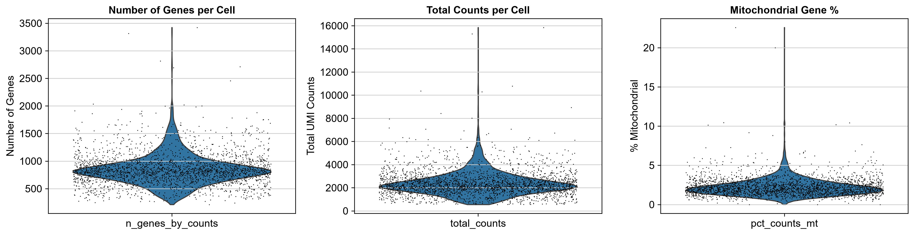
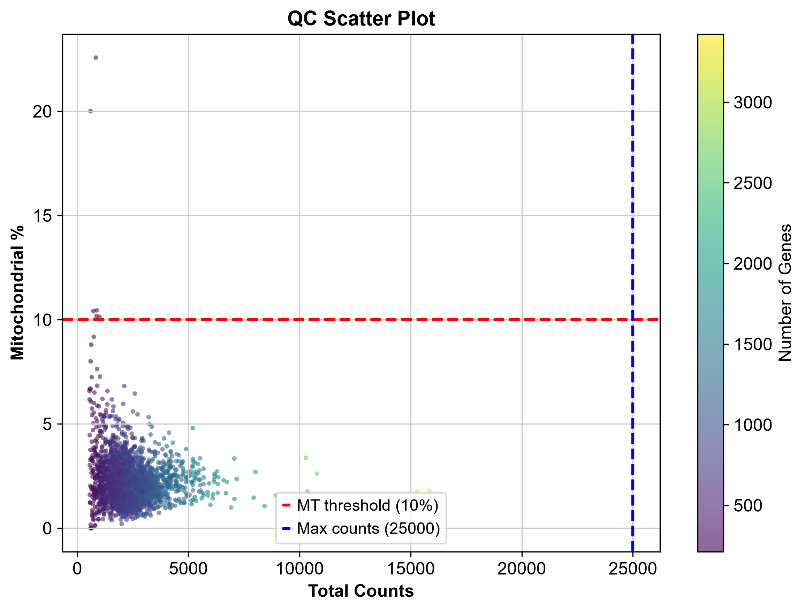
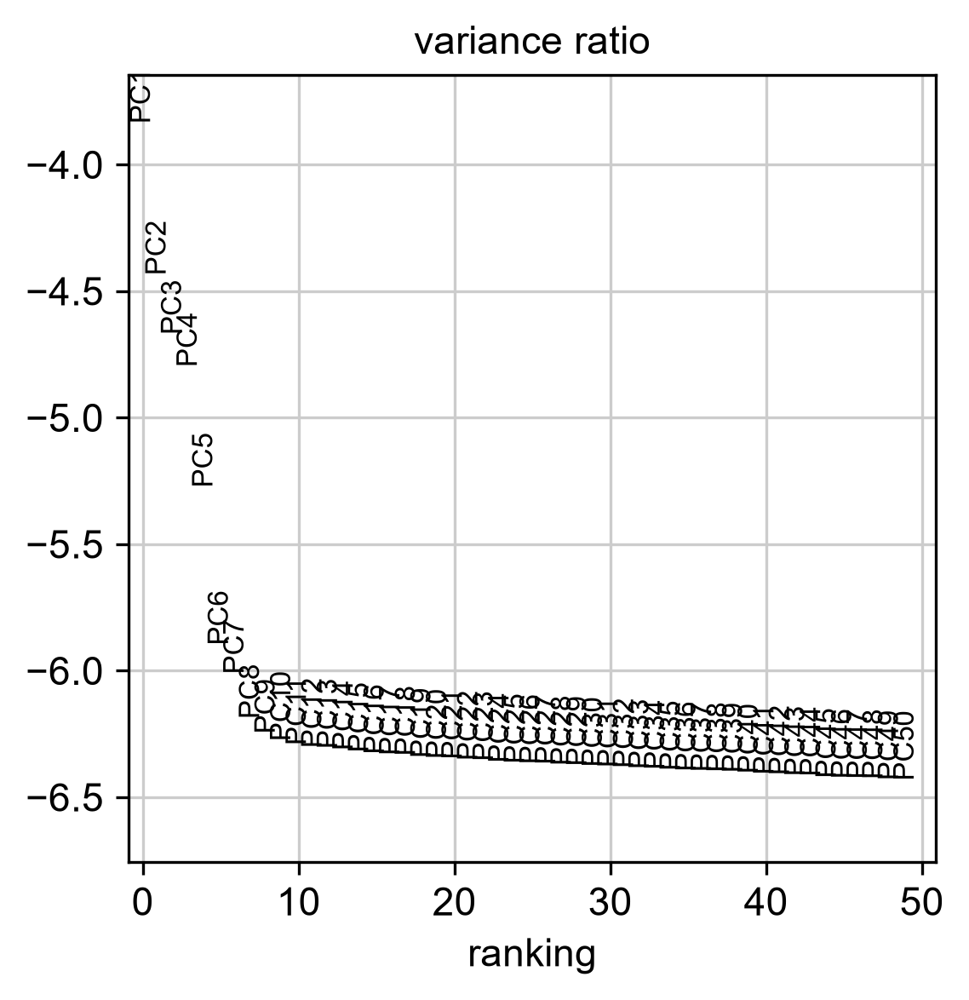
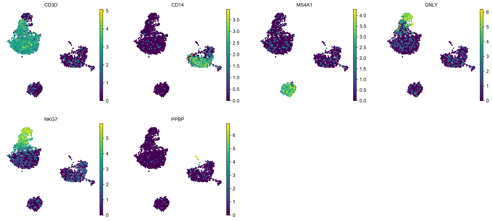
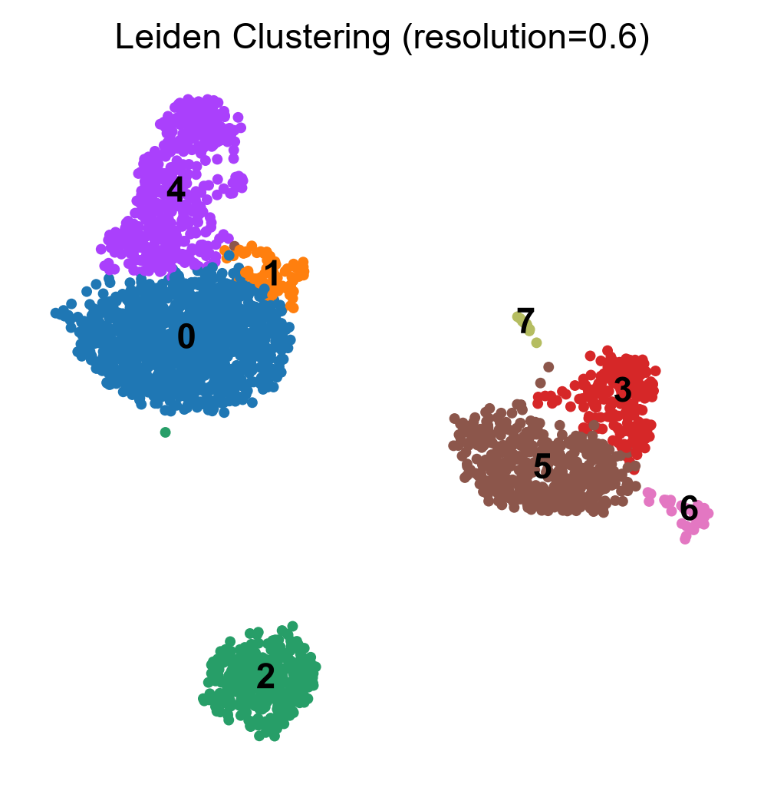
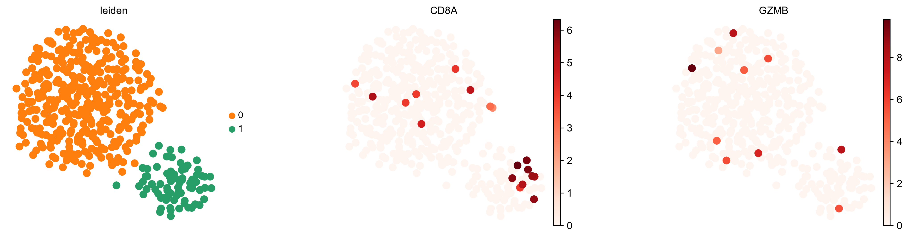

# Single-Cell RNA-seq Analysis of 10x Genomics PBMC 3k Dataset

[](https://www.python.org/downloads/)
[](https://scanpy.readthedocs.io/)
[](https://opensource.org/licenses/MIT)
[](https://jupyter.org/)

---
## 👤 Author

**[Pooya Mosayebi]**  
MSc Student in Genetics and Bioinformatics  
[Email](pooya.mosayebi.genetics@gmail.com) | [Your GitHub]
---

## 📋 Overview

This repository contains a complete, reproducible pipeline for analyzing single-cell RNA sequencing (scRNA-seq) data from the **10x Genomics 3k PBMC dataset**. The analysis follows best practices in computational biology, emphasizing biological interpretability, computational efficiency, and reproducibility.

**Project Status:** ✅ Complete & Validated

---

## 🧬 Biological Context

**Peripheral Blood Mononuclear Cells (PBMCs)** are a heterogeneous population of immune cells critical for adaptive and innate immunity. They include:

- **T cells** (CD4+, CD8+) - Adaptive immunity
- **B cells** - Antibody production
- **Natural Killer (NK) cells** - Innate immunity
- **Monocytes** (classical CD14+ and non-classical FCGR3A+) - Phagocytosis
- **Dendritic cells** - Antigen presentation
- **Platelets** - Coagulation

> **Why scRNA-seq?** Bulk RNA-seq averages gene expression across millions of cells, masking rare cell populations and subtle transcriptional states. scRNA-seq resolves this heterogeneity by profiling individual cells at single-cell resolution.

---

## ️ Pipeline Summary

| Step | Method | Purpose |
|------|--------|---------|
| 1. Quality Control | Mitochondrial %, gene counts | Filter dead cells, doublets, low-quality cells |
| 2. Preprocessing | Normalization, log1p, HVG selection | Prepare data for dimensionality reduction |
| 3. Dimensionality Reduction | PCA (50 PCs) → UMAP (2D) | Remove noise, enable visualization |
| 4. Clustering | Leiden algorithm (resolution=0.6) | Identify cell populations |
| 5. Annotation | Marker gene detection (Wilcoxon) | Assign biological identities |
| 6. Subclustering | T cell heterogeneity analysis | Reveal naive/memory/effector subsets |

---

## 📊 Results

### Quality Control


*Distribution of QC metrics: genes per cell, total counts, and mitochondrial percentage.*


*Scatter plot showing relationship between total counts and mitochondrial percentage.*

### Dimensionality Reduction & Clustering


*PCA variance ratio plot showing the elbow at ~30 PCs.*


*UMAP embedding colored by canonical marker genes.*


*UMAP embedding colored by Leiden clusters (resolution=0.6).*

### Cell Type Annotation


*Final UMAP embedding with manually annotated cell types.*


*Dot plot showing top marker genes for each cluster.*

### T Cell Subclustering


*Subclustering of T cells revealing functional heterogeneity.*

---

## 🧪 Key Findings

We successfully identified **6 major cell populations** in the PBMC dataset:

| Cell Type | Proportion | Canonical Markers |
|-----------|-----------|-------------------|
| T cells | ~45% | CD3D, CD4, CD8A |
| Monocytes | ~20% | CD14, LYZ, S100A8 |
| B cells | ~8% | CD79A, CD79B, HLA-DRA |
| NK cells | ~10% | NKG7, GZMA, CCL5 |
| Monocytes/DCs | ~12% | SAT1, FTH1, TYROBP |
| Other | ~5% | Various |

> **Note:** The number of clusters depends on the resolution parameter. At resolution=0.6, we obtain 6 clusters that capture the major cell types. Higher resolution may reveal additional subpopulations.

---

##  Requirements & Setup

### Prerequisites

- Python 3.10 or higher
- Git
- (Optional) Conda/Mamba for environment management

### Installation

1. **Clone the repository:**
   ```bash
   git clone https://github.com/YourUsername/pbmc3k-scrnaseq-pipeline.git
   cd pbmc3k-scrnaseq-pipeline

**🎯 End of README**