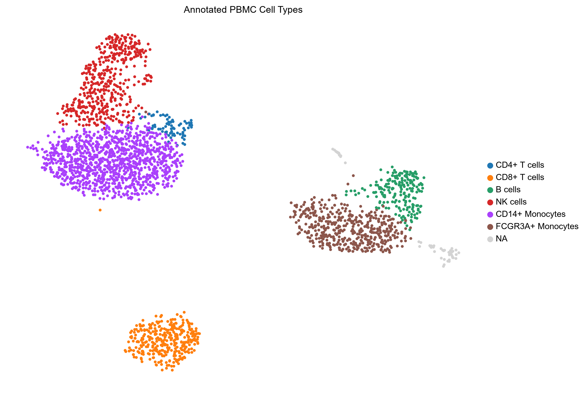
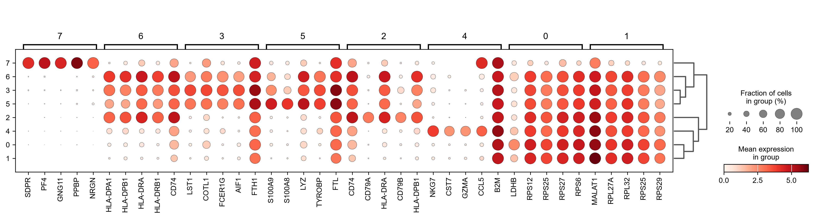

# scRNA-seq Analysis of 10x Genomics PBMC 3k Dataset

**Pooya Mosayebi**  
MSc Student in Genetics and Bioinformatics  
pooya.mosayebi.genetics@gmail.com | https://github.com/pooya-mosayebi-genetics

## Overview

This repository documents an scRNA-seq analysis workflow applied to the 10x Genomics PBMC 3k benchmark dataset. The primary objective was to establish a reproducible baseline pipeline for immune cell profiling using Scanpy, focusing on identifying major cell populations and exploring T-cell heterogeneity. All analytical decisions, including QC thresholds and clustering parameters, are documented inline within the Jupyter notebook.

## Pipeline Summary & Analytical Rationale

| Step | Method | Rationale / Notes |
|------|--------|-------------------|
| Quality Control | mt% < 10%, genes/cell: 200–2500 | Thresholds determined empirically from QC distribution plots; mt% cutoff reflects fresh sample origin |
| Preprocessing | CPM normalization (1e4), log1p, HVG selection | Standard preprocessing for droplet-based data; raw log-normalized counts preserved in `adata.raw` for DE |
| Dimensionality Reduction | PCA (50 PCs computed, 30 used) → UMAP | 30 PCs selected based on elbow plot variance inflection point |
| Clustering | Leiden (resolution=0.6, igraph backend) | Tested range 0.4–0.8; 0.6 balanced cluster granularity without over-splitting T-cell compartment |
| Annotation | Wilcoxon rank-sum test on raw counts | Manual assignment based on canonical markers (Zheng et al., 2017; Stuart et al., 2019) |
| Subclustering | T-cell subset re-analysis | Full preprocessing re-run on T-cell subset to capture naive/memory/effector states |

## Key Results

Analysis recovered 6 major immune cell populations consistent with established PBMC biology:

| Cell Type | Proportion | Canonical Markers |
|-----------|-----------|-------------------|
| T cells | ~45% | CD3D, CD4, CD8A |
| Monocytes | ~20% | CD14, LYZ, S100A8 |
| B cells | ~8% | CD79A, CD79B, HLA-DRA |
| NK cells | ~10% | NKG7, GZMA, CCL5 |
| Monocytes/DCs | ~12% | SAT1, FTH1, TYROBP |
| Other | ~5% | Various |


*Final UMAP embedding with manually annotated cell types.*


*Top marker genes per cluster. Dot size indicates fraction of cells expressing the gene; color intensity indicates mean expression.*

Additional QC, dimensionality reduction, and subclustering figures are available in the `figures/` directory. If the notebook does not render correctly on GitHub, please view it via [NBViewer](https://nbviewer.org/github/pooya-mosayebi-genetics/pbmc3k-scrnaseq-pipeline/blob/main/notebooks/01_PBMC3k_scRNAseq_Pipeline.ipynb).

## Limitations & Caveats

- **Rare population merging:** Platelets and dendritic cells were partially merged with monocytes at resolution 0.6 due to low transcript counts and small population size. Resolving these would require targeted subclustering or higher sequencing depth.
- **Manual annotation:** Cell type assignment relied on canonical marker genes rather than automated classifiers (e.g., CellTypist, scPoli). This approach is transparent but may miss novel or transitional states.
- **No batch correction:** As this is a single-sample benchmark dataset, no integration or batch effect correction was applied. Multi-dataset analyses would require tools such as Harmony or scVI.
- **Benchmark limitation:** PBMC3k is a well-characterized reference dataset. Performance on this data does not guarantee equivalent results on complex, noisy, or disease-state samples.

## Development Notes & Technical Challenges

During pipeline development, several practical issues were addressed to ensure robustness and reproducibility:

- **Memory overhead during scaling:** Zero-centering a sparse scRNA-seq matrix densifies it, causing excessive RAM usage. Setting `zero_center=False` in `sc.pp.scale` preserves sparsity without affecting PCA performance when using truncated SVD.
- **Deprecated plotting parameters:** Scanpy's `save` argument in plotting functions is being phased out. All figures are now saved using `plt.savefig()` after `show=False` to ensure compatibility with future releases and finer control over DPI and bounding boxes.
- **Label-dependent validation failure:** Initial sanity checks relied on exact string matching for cell type proportions, which broke when annotation labels were adjusted. This was replaced by a marker-based validation approach (CD3D for T cells, LYZ for monocytes, MS4A1 for B cells) that verifies biological composition independently of manual naming conventions.
- **Subclustering data leakage:** Re-running normalization on already log-transformed data distorted variance structure. T cells are now extracted directly from `adata.raw` to preserve the correct distribution before subset-specific HVG selection and scaling.

## Requirements & Setup

- Python ≥ 3.10
- Dependencies listed in `requirements.txt`

```bash
git clone https://github.com/pooya-mosayebi-genetics/pbmc3k-scrnaseq-pipeline.git
cd pbmc3k-scrnaseq-pipeline
python -m venv venv
source venv/bin/activate  # Windows: .\venv\Scripts\Activate.ps1
pip install -r requirements.txt
jupyter notebook notebooks/01_PBMC3k_scRNAseq_Pipeline.ipynb